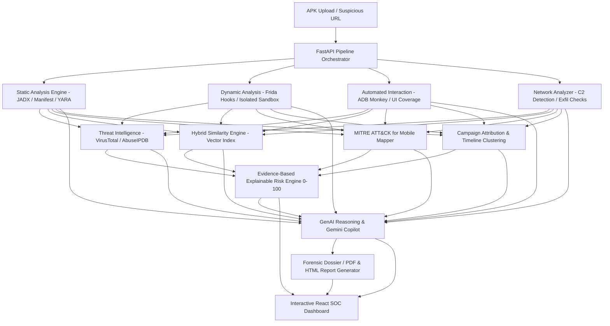

# Generative AI-Based Automated Analysis and Risk Scoring of Fraudulent APKs

An analyst-grade cybersecurity platform and SOC investigation workbench for automated static, dynamic, network, and threat-intelligence analysis of suspicious Android APKs. Integrates hybrid malware family similarity vector matching (FAISS-compatible), MITRE ATT&CK for Mobile mapping, explainable evidence-based 0–100 risk scoring, and a Generative AI investigation assistant.

---

## Architecture Overview



---

## Key Features

1. **Static Analysis Module**:
   - Manifest permission risk classification (Dangerous, Privileged, System).
   - Embedded string and URL / IP extraction.
   - Obfuscation and dynamic class loading detection (`DexClassLoader`, Reflection, Base64+AES cipher routines).
   - YARA rule signature packs for Banking Trojans, SMS Stealers, Ransomware, and Spyware.
   - Fraud-specific pattern detection (Overlay injection, Accessibility hijacking, SMS listeners, Indian banking targeting).

2. **Isolated Dynamic Sandbox & Interaction**:
   - Frida runtime instrumentation hooks tracing sensitive API calls (Crypto, Telephony, Accessibility, Overlay, SharedPreferences).
   - Filesystem mutation and process monitoring.
   - ADB Monkey and scripted UI action exploration tracking screen coverage.
   - Built-in safe simulation replay adapter for instant hackathon demonstrations without host risk.

3. **Network Analysis & Threat Intelligence**:
   - C2 domain and IP detection, phishing URL identification, and exfiltration channel classification.
   - External Threat Intel adapters for **VirusTotal** and **AbuseIPDB** with real API key support and realistic demo fallback.

4. **Hybrid Malware Family Similarity**:
   - Vector similarity scoring matching against known Android malware families (*Fake SBI Banking Trojan*, *SharkBot / TeaBot*, *SpyLoan / FastCash Syndicate*, *WhatsApp OTP Stealer*, *Clean Utility*).
   - Explainable similarity breakdowns (e.g. `92.4% match to Fake SBI Trojan`).

5. **MITRE ATT&CK for Mobile Auto-Mapping**:
   - Automated tagging of adversary tactics & techniques (*T1400 Accessibility Abuse*, *T1417 Keylogging*, *T1582 SMS Interception*, *T1437 Application Layer Protocol C2*, *T1430 Location Tracking*).

6. **Explainable Risk Scoring Engine (0–100)**:
   - Configurable weighted category score formula with transparent audit trails.
   - Severity classification: `0–24 Low`, `25–49 Medium`, `50–74 High`, `75–100 Critical`.

7. **Generative AI Investigation Copilot**:
   - Powered by Gemini API / local evidence-grounded inference.
   - Answers natural language questions strictly grounded in verified database findings (*"Why was this classified as high risk?"*, *"Which IOCs should be blocked?"*, *"Show credential theft evidence"*).

8. **Forensic Report Generation**:
   - Generates analyst-grade & executive-grade HTML and printable PDF dossiers with 1-click export.

---

## Quick Start & Installation

### Prerequisites
- Python 3.10+
- Node.js 18+ and npm

### 1. Backend Setup
```bash
# Navigate to project directory
cd "/path/to/project"

# Activate virtual environment
source venv/bin/activate

# Install dependencies (already prepared)
pip install -r backend/requirements.txt

# Start FastAPI backend server
python -m uvicorn backend.app.main:app --host 0.0.0.0 --port 8000 --reload
```
API Documentation (Swagger UI) is available at: `http://localhost:8000/docs`

### 2. Frontend Setup
```bash
# In a new terminal window
cd frontend

# Start Vite React dev server
npm run dev
```
Open Dashboard at: `http://localhost:5173`

---

## Running Tests
Run the comprehensive test suite:
```bash
source venv/bin/activate
pytest backend/tests/
```

---

## Hackathon Demonstration Script

1. **Explore the SOC Dashboard**:
   - Open `http://localhost:5173`.
   - Inspect overall metrics: Scanned APKs, Critical Threats, Active Campaigns, Average Risk Score.
2. **Review Pre-Loaded Forensic Dossiers**:
   - Click on **SharkBot_UPI_Stealer_2024.apk** (Critical 94.5/100).
   - Inspect the **Circular Risk Gauge**, **Static Findings** (Accessibility & Overlay hooks), **Dynamic Frida Trace**, **C2 Endpoints**, and **MITRE ATT&CK Matrix**.
3. **Engage the AI Investigation Copilot**:
   - Click **AI Investigation Copilot** on the sidebar.
   - Click prompt chips: *"Why was this APK classified as high risk?"* or *"Which IOCs should be blocked?"*
   - Verify grounded citations and zero hallucinations.
4. **Inspect Campaign Attribution**:
   - Click **Threat Campaigns** on sidebar to view *Operation FakeYONO Phish* and *ShadowLender Network* graphs and timelines.
5. **Trigger Live Synthetic Test**:
   - Go to **Analyze APK / URL** -> click **Pre-Loaded Test APKs** -> click **+ Test Banking Trojan**.
   - Watch the multi-stage async pipeline progress from 0% to 100% in real-time.
6. **Download / Print Forensic Dossier**:
   - Open the investigation -> navigate to **Forensic Report** -> click **Open Printable Dossier**.
